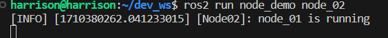

# ROS2 Basic

The project I worked on recently will use ROS2, so I learned the basic usage. This is a project to demonstrate basic ROS2 functionality, including publisher and subscriber nodes

## Table of contents

- [Install](#Install)
- [Use](#Use)
- [Contribution](#Contribution)

## Install

[Tutotial Document](https://docs.ros.org/en/iron/Tutorials.html)

I tried to install it using windows, and another friend tried to install it using mac, but we all encountered problems during the "build". Then I finally chose to install Ubuntu on a virtual machine, and then connected it using SSH in VScode for programming. And it is easier to install.

## Use

1. Clone repository: `git clone https://github.com/Erio-Harrison/ros2_basic.git`

   Then: `cd ros2_basic`

2. Install dependencies: `rosdep install --from-paths src --ignore-src --rosdistro iron -y`

   Here I installed the iron version. If use others, please replace "iron" with sepcific version name.

3. Build the workspace using "colcon": `colcon build`

   If we wanna build specific folder, use: `colcon build --packages-select <packages-name>`

   For example: `colon build --packages-select node_demo`

4. In a new terminal session, type this to use the newly built package:

   `source /opt/ros/iron/setup.bash`   

   `source install/setup.bash`

   Please note that every time we open a new terminal, we need to run this command.

   If you don't want to do so. another way is trying to edit `.bashrc` file:

   First, type `nano ~/.bashrc` in terminal

   Second, Add the following lines at the end of the file:

   `source /opt/ros/iron/setup.bash`

   `source ~/Desktop/ros2_basic/install/local_setup.bash`

   In order for these changes to take effect, you have two options:

   **Effective immediately**: Run the following command in the current terminal to apply the changes immediately: `source ~/.bashrc`

   **Reopen the terminal**: Close the current terminal and reopen a new terminal. Changes in `.bashrc` will be applied automatically.

5. Run the sample programs in the project: `ros2 run <your_package_name> <your_executable_name>`

   Example: `ros2 run node_demo node_02`

   Then we can see this:

   

   Others can also be seen on images.

## Contribution

If anyone wants to add examples based on this, please directly apply for PR.